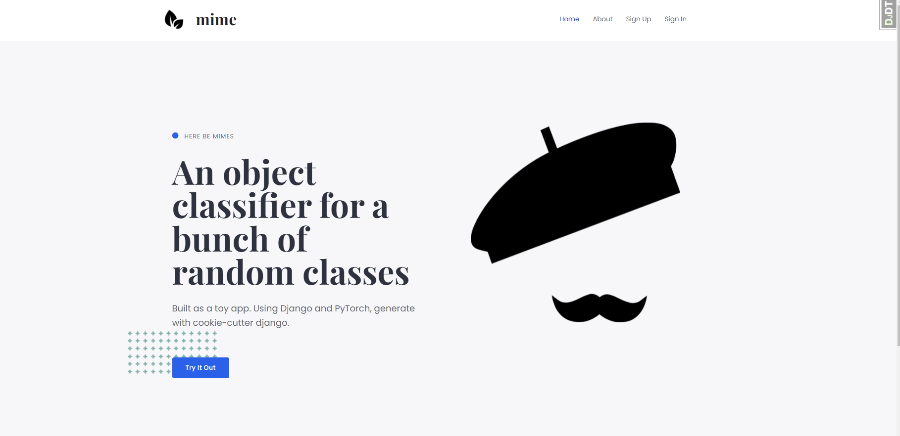
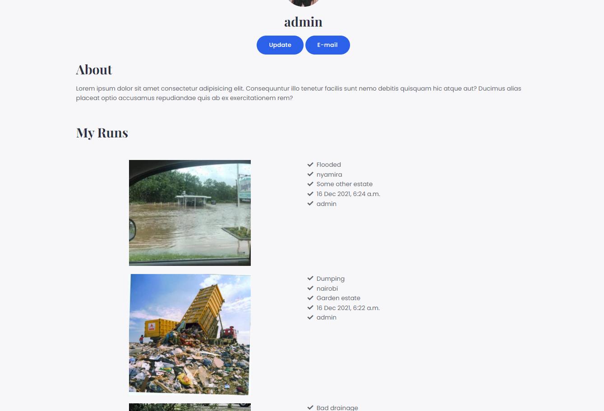

<p align="center">

</p>

> Photo by <a href="https://unsplash.com/@fatihkilic?utm_source=unsplash&utm_medium=referral&utm_content=creditCopyText">Fatih Kılıç</a> on <a href="https://unsplash.com/s/photos/mime?utm_source=unsplash&utm_medium=referral&utm_content=creditCopyText">Unsplash</a>


# mime

> Here be mimes!

[](https://github.com/cookiecutter/cookiecutter-django/) [](https://github.com/ambv/black)

# What is this?

This is me goofing around and trying to learn some Django the only way there is, (by attempting to build something and combining it with a bunch of other things i know or have come across).

> I also don't have a job so need to do something with my life. 😏😏


# Environment
This a django based "web app" that uses a Densenet 121 model trained to classify 6 classes of objects.

The classification routes aren't wired up but should be pretty straightfoward to do that. I like swagger UI docs so I have those included as well.
The design was done with wp elementor and just dumped the html and wired it up with django views. (pretty "low energy" endeavor).

### Classes
- Potholes
- Dumping
- Accidents
- Flooded
- Bad drainage
- Construction

The training code repo can be found in this [linked repo](https://github.com/mrdvince/ajime). Which also included as a submodule here.
# Getting started
### Dependencies
1. Docker and docker compose
For windows download docker desktop and that should get sorted out.

#### Linux

```bash
# Download Docker
curl -fsSL get.docker.com -o get-docker.sh
# Install Docker using the stable channel (instead of the default "edge")
CHANNEL=stable sh get-docker.sh
# Remove Docker install script
rm get-docker.sh

# Docker compose
sudo curl -L "https://github.com/docker/compose/releases/download/1.29.2/docker-compose-$(uname -s)-$(uname -m)" -o /usr/local/bin/docker-compose
```

2. Clone the repository (if you haven't already)
> Using recursive to include the submodule repos in the cloned directory.

```bash
git clone --recursive https://github.com/mrdvince/mime
cd mime
```

3. Running it
Once cloned is done simply use docker to run it and evrything should just work.

The model is included in the ajime submodule, can be retrained or completely swapped out if needed.

```bash
# This should get you up and running
docker-compose -f local.yml up -d --build

```
## Settings

### Setting Up Your Users

- To create a **normal user account**, just go to Sign Up and fill out

- To create an **superuser account**, use this command:

      $ python manage.py createsuperuser

### Type checks

Running type checks with mypy:

    $ mypy mime

### Test coverage

To run the tests, check your test coverage, and generate an HTML
coverage report:

    $ coverage run -m pytest
    $ coverage html
    $ open htmlcov/index.html

#### Running tests with py.test

    $ pytest

## Screenshots are nice
 


## Appendix

1. Using cookie-cutter django was a bit overkill for this.
2. Shelving this and moving on to other shiny things
3. Will be trying to write a post about this so check it out [mrdvince](mrdvince.me)
